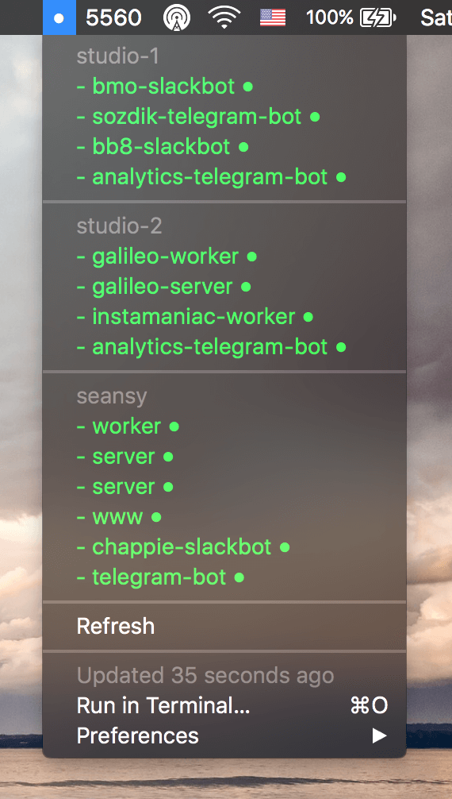

# pm2-check
**A [BitBar](https://github.com/matryer/bitbar) plugin that checks the status of your PM2 processes**

[![Build Status][travis-image]][travis-url] [![Dependency Status][daviddm-image]][daviddm-url]



## Installation

1\. Clone the repo somewhere on your computer:

```bash
git clone https://github.com/yenbekbay/pm2-check.git <path-to-pm2-check>
```

2\. Copy `config.json-example` to `config.json` and fill the info for one or more servers. Make sure that you have a private key set up for each of the servers you enter.

3\. Install all dependencies by running:

```bash
npm install
```

4\. Finally link the plugin to your BitBar plugin directory and set the refresh rate:

```bash
ln -s <path-to-pm2-check>/index.js <path-to-bitbar-plugins>/pm2-check.30m.js
```

5\. Refresh the plugins with BitBar and key an eye on your processes. :)

## The MIT License

MIT © [Ayan Yenbekbay](http://yenbekbay.me)


[travis-url]: https://travis-ci.org/yenbekbay/pm2-check
[travis-image]: https://img.shields.io/travis/yenbekbay/pm2-check.svg

[daviddm-image]: https://david-dm.org/yenbekbay/pm2-check.svg?theme=shields.io
[daviddm-url]: https://david-dm.org/yenbekbay/pm2-check
